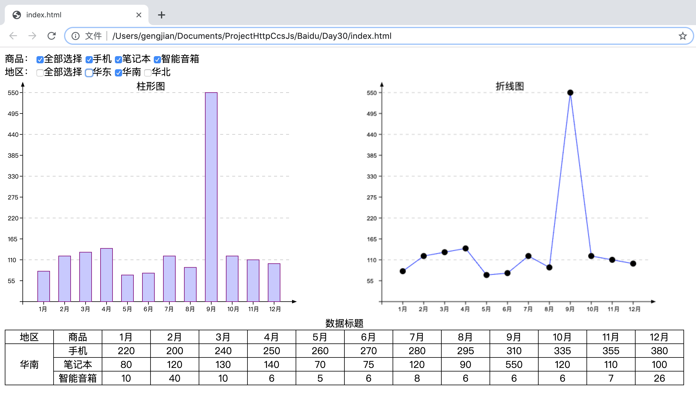

# 百度前端技术学院  
## 第三十一天到第三十三天：我是精明的小卖家（一）
### 课程目标  
这次的任务将会分解为好几个子任务，是我们以后在工作中会经常遇到的项目类型--MIS系统，我们今天将会以MIS系统中的一个简单的页面示例，来让大家尝试一下稍微复杂的页面功能，我们如何进行拆解。

### 最终需求描述
* 这是一个数据报表定制页面，有许多筛选表单，有一个表格，以及几个图表，需要我们在不使用任何框架的情况下，完成这个页面的开发
* 页面初始化的时候，显示默认的数据及图表
* 根据用户的表单选择，可以进行数据和图表的切换，但这些切换动作都是在当前页面中完成
* 用户可以在当前页面上做一些数据修改，我们先设定这些修改仅对自己有效，将数据存在浏览器本地
* 当用户选择了某种数据视图（选择了某些选项所展示的数据及图表）后，可以复制当前URL给其他人，其他人也能看见同样的视图，而不是回到初始化效果
* 我们会提供一份数据用例：链接: https://pan.baidu.com/s/1ckhyN9_vyKnWgB9icJmBpg 密码: tbwy

### 任务拆解
和上一个任务画流程图不一样的是，这个任务不仅要画流程图，还需要画一个整体的模块关系图，整个任务可以大致分为几个模块：路由模块，表单模块，数据处理模块，表格模块，图表模块。

* 路由模块负责指挥页面的其它部分，该以什么样的状态来呈现页面
* 表单模块负责承接用户的交互及告诉后面的模块如何组装数据，展示图表
* 数据处理模块，则根据用户的输入，对数据进行组合，提供给页面展现
* 表格模块负责用表格的形式展现数据
* 图表模块负责用图表的方式展现数据

### 需求1
* 表单：我们先从最简单的表单开始，我们的数据维度有：月、地区、商品种类，表单选项的任务就是做这几个维度的筛选或者组合的设置。我们先只做一个，用来做示例，比如我们选择用地区，请用一个Select或者单选，让用户可以选择地区。选项应该包括华东、华南、华北三个地区。
* 数据处理：接下来，我们根据用户选择的地区表单，从完整数据中，把对应选择地区的数据取出来。
* 表格：最后，将上一步取出来数据渲染成表格，表格有一个表头，用于显示数据标题：商品、地区、1月、2月……12月，然后共有14列：商品、地区、以及12个月的销售情况

### 需求2
* 我们现在加入第二个表单，商品种类，依然是select或者radio，自选。
* 两个表单项都存在，做并集的选择，比如选了华北，和手机，表示要看华北地区手机的销售情况
* 两个表单项的选择互相不干扰，即改变其中一个时候，不会导致另外一个的选项的变化

### 需求3
* 我们发现，有时候我们不止要看某个地区的数据，我们可能会想同时看好几个地区的数据，或者我们想看某个地区所有商品的销售情况，所以我们需要把地区及商品从单选改成多选
* 同时，为了方便多选，我们提供了一个功能叫做全部选择，分别给地区和商品各增加一个全选的CheckBox，全选有如下状态和逻辑：
* 点击全选时，如果单个选项中只要有一个不是被选上的状态，则进行全选操作
* 点击全选时，如果单个选项中所有选项都已经是被选上的状态，则无反应
* 点击最后一个未被选中的单个选项后，全选CheckBox也要置为被勾选状态
* 如果当前是全选状态，取消任何一个子选项，则全选CheckBox也要置为未勾选状态
* 不允许一个都不勾选，所以当用户想取消唯一一个被勾选的子选项时，无交互反应，不允许取消勾选

### 需求4
* 现在，我们给表格也提出了更复杂的需求，之前我们仅仅需要单纯的遍历数据，然后一行一行，一格一格输出即可，但当突然出现多选的情况下，我们会期望有更好的阅读体验：
* 当商品选择了一个，地区选择了多个的时候，商品作为第一列，地区作为第二列，并且把商品这一列的单元格做一个合并，只保留一个商品名称
* 当地区选择了一个，商品选择了多个的时候，地区作为第一列，商品作为第二列，并且把地区这一列的单元格做一个合并，只保留一个地区名称
* 当商品和地区都选择了多于一个的情况下，以商品为第一列，地区为第二列，商品列对同样的商品单元格进行合并
* 当商品和地区都只选择一个的情况下，以商品为第一列，地区为第二列

## 第三十四天到第三十六天：我是精明的小卖家（二）
### 课程目标  
今天我们将学习SVG和Canvas，来继续丰富我们的销售报表

### 需求描述
当上一课任务完成时，面对一个复杂数据的表格，估计没有人会仔细看这份数据的内容是什么，看也看不出什么。所以我们希望找到某种方式，让数据变得更加易读和易懂，而数据可视化正式解决这一问题的最佳答案。
在表格上方增加两个图表，一个折线图和一个柱状图，用于展现不同数据在12个月的销售情况。

### 需求1
没有过多复杂的要求，我们先把焦点聚焦在图形的绘制上。使用SVG，来实现这个柱状图，包括以下元素：
* 横轴
* 纵轴
* 数据项
* 固定只显示华东地区手机12个月的数据
* 图表样式不做限制，可以参考ECharts
* 暂时不在图表上做任何文字显示

### 需求2
和柱状图一样，包括以下元素：
* 横轴
* 纵轴
* 每个数据对应在坐标中的数据点，可以用一个直径为5的实心圆
* 每个数据点之间连接的直线
* 固定只显示华东地区手机12个月的数据

### 需求3
上面我们的数据都是用的固定的，接下来我们需要让图表的数据可变。  
我们给表格增加一个鼠标滑过的事件响应，当鼠标滑过任何一行时，把这一行的数据在两个图表中进行呈现  
把两个图表做成左右布局，各占一半宽度，表格在图表下方，表单在图表上方，几个内容保证在一个屏幕中能够完整呈现  
如果已经有面向对象基础的同学可以进行类的封装  

## 第三十七天到第三十八天：我是精明的小卖家（三）
### 课程目标  
今天我们将学习LocalStorage，基于它来实现对于数据的写操作

### 需求1
* 我们首先为所有表格增加一个编辑功能，在原来的表格输出的数据单元格，全部变成input输入框，里面为数据。
* 在页面中增加一个保存按钮，点击保存后将数据保存到LocalStorage中
* 页面加载的时候，优先从LocalStorage读取数据

### 需求2
在学习完LocalStorage后，我们需要梳理一下业务流程，首先是数据读取，原来是直接使用提供的JS文件，现在我们需要先判断LocalStorage中是否有数据，有的话从LocalStorage中读取，没有的话再使用JS文件中的数据。  
对于数据的编辑和保存，可以如下实现：  
* 给所有input输入框增加一个onblur事件，在事件中增加对于输入内容的判断，是否为正确的数字，是的话什么都不做，不是的话弹出提示框（alert）
* 点击保存的时候，遍历所有input，按照一定顺序，把数据写入LocalStorage中。

### 需求3
如果对于一个强编辑需求的场景，上面的方案可能合适，甚至可以直接上一个Web电子表格组件，但如果对于数据的编辑是小部分的需求场景时，一堆input框看上去就不是那么优雅了。  
我们希望你实践一下，看上去不是输入框，但鼠标移动上去或者点击就变成一个可编辑的状态。需求如下：  
* 把表格恢复成没有input的状态
* 当鼠标滑动过某一个数字的单元格时，数字旁边显示一个铅笔的icon，或者显示灰色的小小的编辑两个字
* 当鼠标点击某个数字的单元格时，这个数字进入编辑状态，单元格内容变成一个输入框，输入框右边是取消和确定
* 点击取消，输入框消失，恢复出原来数字
* 点击确定，输入框消失，数字变成编辑的，这个过程中需要判断输入的正确性，如果输入的不是数字，则弹出提示
* 点击该单元格以外的页面其他任何地方，除了响应对应行为外，同时等同于点击了取消，输入状态消失
* 理论上，同一时刻，只有一个单元格处于编辑状态
* 在输入框中，按ESC键等同于按取消
* 在输入框中，按回车键等同于按确认

## 第三十九天到第四十一天：我是精明的小卖家（四）
### 课程目标  
今天我们将进行这个任务系列的最后一课，学习Location，Hash等相关知识，来实现最后一个需求

### 需求1
* 现在通过hash的方式
* 把用户的一些交互状态通过某种方式记录在URL中
* 分享或再次打开某个URL，需要从URL中读取到数据状态，并且进行页面呈现的还原
* 需要记录的状态包括：产品的选择以及地域的选择

### 需求2
* 用pushState等代替前面直接操作hash的方式，来实现前面2个小需求及报表页面的需求

### 环境
* 硬件环境  
MacBook Pro
* 软件环境  
MacOS (10.14.2)  
VS Code (version 1.36)  
Google Chrome (75.0.3770.100)  
Firefox (67.0.4)  

### 作品展示
[展示链接](https://gengjian1203.github.io/BaiDuIFE_Day31/)  
  
  
  
  

### 相关链接
[百度前端技术学院-第三十一天到第三十三天：我是精明的小卖家（一）](http://ife.baidu.com/course/detail/id/53)  
[百度前端技术学院-第三十四天到第三十六天：我是精明的小卖家（二）](http://ife.baidu.com/course/detail/id/55)  
[百度前端技术学院-第三十七天到第三十八天：我是精明的小卖家（三）](http://ife.baidu.com/course/detail/id/56)  
[百度前端技术学院-第三十九天到第四十一天：我是精明的小卖家（四）](http://ife.baidu.com/course/detail/id/57)  
